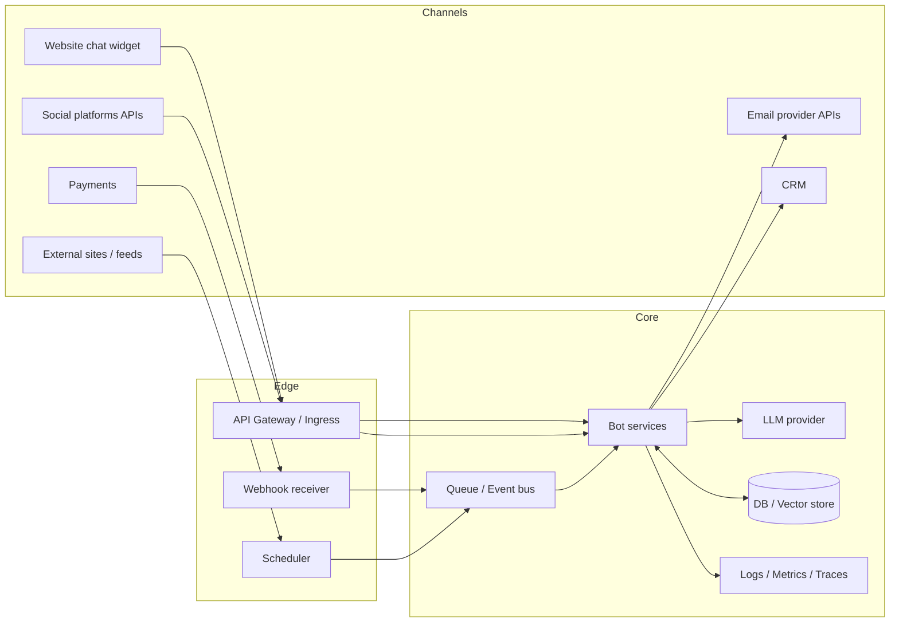
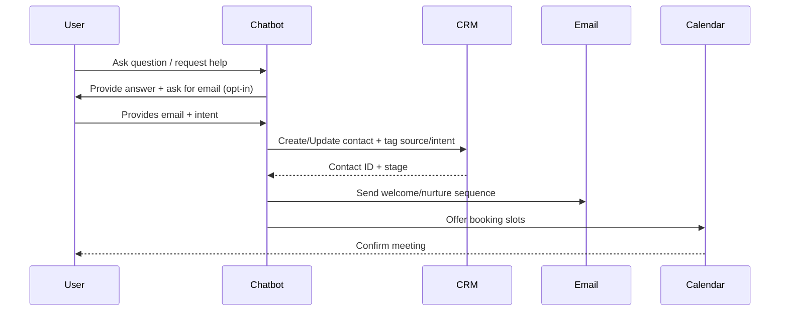

# Bot and Automation Strategy for JayPVentures

## Executive summary

JayPVentures can treat “bots” as a portfolio of small, event-driven systems that (a) capture demand (traffic → leads), (b) convert demand (leads → purchases), and (c) retain/expand demand (support → renewals/upsells), while (d) reducing operational load through workflow automation. The highest-ROI approach is to build a shared “automation spine” (identity, logging, prompt/tool governance, data stores, queues, and deployment) and then snap in specialized bots by channel (web chat, email, social, e-commerce, monitoring). This reduces marginal cost per bot and makes “passive monetization” more realistic because maintenance overhead is the primary hidden tax in bot portfolios. citeturn8search2turn4search7turn3search11

A practically modern agent stack should prefer the entity["company","OpenAI","ai model provider"] Responses API for new builds and tool-calling, because the older Assistants API has a published deprecation and a shutdown date of **August 26, 2026**—a material design constraint if you want bots to remain stable through 2026–2027. citeturn11search3turn0search8turn11search7turn11search5

Low-code platforms can accelerate operations-heavy automation (approvals, notifications, CRM data sync), especially in ecosystems already using entity["company","Microsoft","software company"] services (Power Automate, Copilot Studio connectors). They provide prebuilt triggers/actions and hundreds of connectors, which is ideal for operational leverage and quick experiments, while code-first services typically win for differentiated monetization products (micro-SaaS, public APIs, custom scoring models). citeturn0search2turn0search6turn0search14turn0search1

The recommended delivery sequence is:
- Short term (weeks): customer-support chatbot + lead capture + outbound email automation + content/post scheduling with guardrails.
- Medium term (months): price/deal monitoring + e-commerce lifecycle automation + analytics anomaly detection + lightweight “productized service” bots.
- Long term (quarters): monetizable bots as products (subscription dashboards, premium alert services, templates/workflows, or API access), plus higher-compliance-risk areas (lead resale, trading automation) only if governance and legal controls are mature. citeturn5search0turn2search0turn2search2turn10search1turn6search4

## Assumptions and scope

Assumptions used to build a concrete plan (adjustable without changing the architecture):
- JayPVentures is digital-first and sells a mix of services, digital products, affiliate recommendations, or small e-commerce offers; exact vertical is not specified, so proposals emphasize reusable “business primitives” (lead capture, nurturing, checkout, support, reporting).  
- The company wants “passive” revenue levers that are realistically “mostly automated” but still compliant and maintainable (monitoring, model updates, content review gates).  
- Primary channels likely include a website, at least one major social platform, email marketing, and some form of checkout/payment processor.  
- Data handled may include PII (emails, names, purchase history), so privacy/security and marketing compliance are baseline, not optional. citeturn2search1turn2search2turn2search0turn4search7
- This report describes operational and technical options and common compliance risks; it is not legal advice and cannot replace counsel review for your jurisdiction(s).

Scope definition: “Bots and automation tools” includes chatbots, scheduled agents, webhook-driven automations, monitoring/scraping jobs, CRM workflows, content generation pipelines, and analytics/insight agents, whether built in code or assembled in platforms like Power Automate / Zapier / n8n. citeturn8search2turn0search6turn3search16turn3search1

Key official references are embedded as citations throughout: OpenAI Responses & tools/Connectors/MCP, Copilot Studio connectors/auth, Power Automate triggers/actions/connectors, platform posting APIs (Instagram/X/LinkedIn), Shopify webhooks/Admin API, Stripe Billing/webhooks, HubSpot CRM APIs/auth, and core legal guidance (FTC CAN-SPAM + endorsements; GDPR; CCPA/GPC). citeturn11search5turn0search1turn0search14turn1search0turn1search1turn1search22turn1search7turn4search5turn16search0turn2search0turn2search1turn5search0turn5search8turn5search3

## Bot inventory and monetization playbooks

The inventory below is organized by the bot types you requested. Each entry includes purpose, value proposition, revenue models, integrations, data/security, KPIs, implementation effort/cost, and legal/compliance risks. Tool examples are illustrative; choose based on existing stack and channel priorities.

**Chatbots (general-purpose conversational bots)**  
Purpose: Provide interactive guidance on the website or in community channels; answer FAQs; recommend products/content; route to checkout or booking.  
Value proposition: Converts anonymous traffic into qualified leads by resolving friction and giving a “choose-your-own-path” funnel; reduces manual back-and-forth. The Responses API supports multi-turn interactions, built-in tools (web/file search, code interpreter), and function calling, enabling “chat → action” workflows (lookup, quote generation, booking). citeturn11search5turn11search1turn15view1turn0search4  
Revenue models: Upsell to paid consult/booking, subscription support tier, transaction fee on bookings, affiliate link recommendations, lead sale (higher risk).  
Required integrations: Website widget; CRM; knowledge base; booking and payments; optionally remote MCP server to connect proprietary data sources. citeturn11search2turn11search10turn0search1  
Data/privacy/security: Treat chat transcripts as PII if they contain personal details; apply minimization and purpose limitation (store only what you need). For LLM tools and connectors, consider third-party retention policies and ensure contractual + technical alignment. citeturn2search1turn11search37  
KPIs: Chat-to-lead rate, chat containment rate (% resolved without human), conversion rate after chat, AHT saved, CSAT, deflection ROI.  
Effort/cost: Medium (if grounded + tool calling); Low for a simple FAQ bot.  
Legal/compliance risks: Misleading claims, insufficient disclosures for affiliate recommendations, privacy notice gaps, accessibility/consumer protection issues. citeturn5search33turn5search0turn2search2

**Customer support bots (specialized support + ticketing automation)**  
Purpose: First-line support, returns/refunds guidance, order status, troubleshooting; create or update tickets; escalate with context.  
Value proposition: Lowers support burden, improves response time, and increases retention. Supports fulfillment automation via webhooks (orders, refund states) and payments systems with verified events. citeturn1search11turn4search4turn4search24  
Revenue models: Indirect—reduces churn; direct—paid “priority support,” warranty/coverage upsells, or higher-tier subscription support.  
Required integrations: Ticketing/CRM; e-commerce orders; knowledge base; payment processor webhooks (signature verification). citeturn16search0turn4search4turn4search0  
Data/privacy/security: Strong authentication patterns; least-privilege scopes; audit trails; secure webhook verification. Reference API security risks such as broken auth and misconfiguration as baseline controls. citeturn4search6turn4search2turn4search30  
KPIs: Ticket deflection, first contact resolution, time-to-first-response, escalation quality, refund rate impact, churn reduction.  
Effort/cost: Medium.  
Legal/compliance risks: Mishandling refunds/chargebacks, storing card data (avoid), privacy obligations, consumer protection misstatements. PCI DSS applies if you store/process/transmit card data—design to avoid storing CHD/SAD. citeturn10search3turn10search31turn10search15

**Social media posting and engagement bots**  
Purpose: Schedule posts, generate variations, repurpose content, respond to comments/DMs within policy, and drive traffic to offers.  
Value proposition: Maintains consistent publishing cadence; compounding attention effect; faster experimentation (hooks, creatives) with guardrails.  
Revenue models: Affiliate-driven traffic, ad revenue (where applicable), sponsorship packages, subscription communities, product launches.  
Required integrations: Platform APIs and auth. For Instagram publishing, use the Content Publishing API (Graph API-based) with platform requirements; for X, use API endpoints and correct auth; LinkedIn requires its posting endpoints and headers. citeturn1search0turn1search24turn1search1turn1search9turn1search22  
Data/privacy/security: Token security is the main risk; protect OAuth tokens, rotate, and minimize scopes; rate-limit to avoid API abuse.  
KPIs: Posts/week, CTR to site, follower growth quality, engagement rate, attributed leads/revenue, content production cost per asset.  
Effort/cost: Medium (auth + compliance); Low for single-platform posting with manual token setup.  
Legal/compliance risks: Platform policy violations, disclosure failures for endorsements/affiliate links, and deceptive advertising. FTC endorsement guidance and disclosure clarity are especially relevant. citeturn5search8turn5search0turn5search1turn1search20

**AI content generation bots (content factory + repurposing pipeline)**  
Purpose: Generate drafts for blogs, emails, product descriptions, video scripts, social threads; automatically repurpose into multiple formats and schedule.  
Value proposition: Reduces content cycle time and cost; increases volume without linear headcount. Use OpenAI Responses with tool calling (e.g., “pull top FAQs → write post → create social snippets → schedule”). citeturn11search24turn11search5turn15view1  
Revenue models: Affiliate content sites/newsletters, ad-supported content, paid subscriptions, content licensing, lead magnets.  
Required integrations: CMS, social scheduler, brand style guide repository, plagiarism/quality checks, analytics feedback loop (GA4 reports API-driven). citeturn12search0turn12search12turn11search1  
Data/privacy/security: Avoid uploading confidential proprietary drafts to third parties without policy; enforce internal review gates for regulated claims (finance/health). For MCP/connector use, confirm third-party retention policies. citeturn11search37turn2search1  
KPIs: Time-to-publish, content acceptance rate after review, organic traffic growth, RPM/affiliate EPC, list growth rate.  
Effort/cost: Medium.  
Legal/compliance risks: Copyright/attribution risk, false claims, endorsement disclosure for affiliate content, consumer protection enforcement. citeturn5search33turn5search0

**E-commerce bots (store operations + conversion automation)**  
Purpose: Automate product listing updates, pricing rules, inventory alerts, abandoned checkout flows, fulfillments, refunds, and customer messaging.  
Value proposition: Improves conversion and reduces operational errors; enables “always-on” merchandising (especially for affiliate and dropship models) while staying synced via webhooks. Shopify webhooks reduce polling and enable near-real-time updates. citeturn1search11turn1search15turn1search7  
Revenue models: Direct sales margin, upsells/cross-sells, subscription boxes, transactional fees for digital fulfillment, partner revenue shares.  
Required integrations: Store platform APIs; logistics/fulfillment; email/SMS; payment processor; analytics. Note Shopify’s Admin REST is described as legacy and Shopify directs new public apps to GraphQL Admin API (timeline noted in docs). citeturn1search3turn1search27turn12search22  
Data/privacy/security: Avoid self-handling card data; rely on payment processors and verify webhooks. Apply API security best practices and resource controls to prevent cost blowups. citeturn4search24turn4search2turn4search6  
KPIs: Conversion rate, AOV, cart abandonment recovery, refund/chargeback rate, order processing time, support tickets per 100 orders.  
Effort/cost: Medium to High (depends on fulfillment complexity).  
Legal/compliance risks: Payments compliance, consumer refund rules, privacy rights for customer data, and marketing compliance for lifecycle messages. citeturn10search3turn2search2turn2search0

**Lead generation bots (prospecting + qualification + routing)**  
Purpose: Capture inbound leads (forms, chat, DMs), enrich/score, route to CRM stages, trigger follow-ups, book meetings.  
Value proposition: Higher close rate and lower CAC by responding quickly and consistently; enforces a standardized qualification rubric.  
Revenue models: Sell services/high-ticket offers, sell qualified leads (high compliance risk), referral/affiliate commissions, subscription access to proprietary lead lists (risk).  
Required integrations: CRM object APIs (create/update contacts), meeting scheduling (calendar APIs), and outreach tools. HubSpot’s CRM APIs support creating contacts via POST endpoints; authentication can be bearer token schemes depending on app mode. citeturn16search0turn16search1turn16search5turn7search0  
Data/privacy/security: Clear lawful basis for processing, retention limits, access control, and audit logs; avoid scraping personal data without rights. citeturn2search1turn2search2turn6search4  
KPIs: Lead-to-MQL rate, MQL-to-sale rate, speed-to-lead, pipeline created per week, cost per lead, lead source ROI.  
Effort/cost: Medium.  
Legal/compliance risks: Privacy law obligations (CCPA/GDPR) for collection and disclosures; if outbound, CAN-SPAM/TCPA. CCPA requires honoring opt-out rights and notices where applicable; GPC can be a valid opt-out mechanism in covered scenarios. citeturn2search2turn5search3turn2search0turn2search1

**Email automation bots (nurture, lifecycle, and transactional email)**  
Purpose: Automated sequences (welcome, nurture, reactivation), transactional email, segmentation, reporting.  
Value proposition: Email remains a high-leverage owned channel; automation compounds list value and reduces manual campaign operations.  
Revenue models: Affiliate newsletters, paid newsletter tiers, product launches, upsell sequences, subscription retention.  
Required integrations: Email delivery provider APIs (e.g., Twilio SendGrid bearer auth), CRM, analytics, suppression lists/opt-out handling. citeturn8search0turn16search2turn2search0  
Data/privacy/security: Maintain list hygiene, secure API keys, and implement opt-out reliably.  
KPIs: Delivered/open/click rates (recognizing privacy-related measurement limits), conversion rate, revenue per subscriber, unsubscribe/spam complaint rate, deliverability health.  
Effort/cost: Low to Medium.  
Legal/compliance risks: CAN-SPAM requirements (truthful headers/subjects, identify advertising where applicable, include physical address, provide opt-out) and enforcement; international lists require GDPR/ePrivacy alignment depending on jurisdiction and consent model. citeturn2search0turn2search4turn6search7turn2search1

**Scraping and monitoring bots (watchers, alerts, and competitive intelligence)**  
Purpose: Monitor price changes, content updates, product availability, policy changes, keyword mentions, and send alerts/digests.  
Value proposition: Enables monetizable “alert products” (deal alerts, niche monitoring newsletters) and improves ops (broken-link monitoring, stockouts, SLA monitoring). Shopify and many APIs also expose webhooks; prefer those over scraping when available. citeturn1search11turn1search7turn3search8  
Revenue models: Paid alert subscriptions, affiliate commissions via deal alerts, sponsorship slots in digests, insights-as-a-service reports.  
Required integrations: Webhooks or crawler infrastructure, queueing, storage, notification channels (email/Slack/SMS), analytics.  
Data/privacy/security: Respect robots.txt semantics (note: robots rules are not authorization) and be cautious with ToS and access controls. citeturn6search2turn6search6  
KPIs: Alert accuracy, time-to-detect, false positive rate, subscriber retention, affiliate EPC uplift from timeliness.  
Effort/cost: Medium (higher if anti-bot measures).  
Legal/compliance risks: Contract/ToS breach, CFAA risk in certain contexts, and litigation exposure even when scraping public data is not “hacking.” The Ninth Circuit’s hiQ v. LinkedIn opinions and CFAA text illustrate that the legal boundary is nuanced; public-site scraping may be treated differently than circumventing authentication, but contractual claims can still matter. citeturn6search4turn6search1turn6search16

**Workflow automation bots (internal ops automation)**  
Purpose: Orchestrate cross-app workflows: intake → approval → execution → logging; automate recurring admin tasks.  
Value proposition: Highest operational ROI; reduces human coordination overhead; makes every other bot less expensive to operate.  
Tooling options:  
- Power Automate cloud flows (trigger + actions model) and large connector library. citeturn0search6turn0search14turn0search38  
- Zapier triggers/actions and webhooks. citeturn3search16turn3search0turn3search8  
- n8n self-hosted or cloud workflows (more control, code hooks). citeturn3search1turn3search9turn3search29  
Revenue models: Indirect (cost reduction); direct (productized workflows/templates, operations consulting retainers).  
Required integrations: OAuth to core systems; secrets management; audit logs. Copilot Studio connectors/custom connectors can also be used to call services from agents with authentication options. citeturn0search1turn0search17turn0search25  
Data/privacy/security: Centralized secrets + least privilege; require approvals for high-risk actions (refunds, payouts).  
KPIs: Hours saved, automation success rate, error rate, cycle time reduction (e.g., lead response time).  
Effort/cost: Low to Medium (platform); Medium to High (custom code).  
Legal/compliance risks: Access control failures (data leak), unintended actions without approvals, recordkeeping gaps.

**Analytics and insights bots (reporting, anomaly detection, decision support)**  
Purpose: Pull metrics from web, store, email, and ads; detect anomalies; generate weekly business briefs; recommend experiments.  
Value proposition: Converts raw data into decisions; reduces time-to-insight; increases revenue by identifying what to double down on.  
Tooling options: GA4 reporting via Google Analytics Data API (runReport etc). citeturn12search0turn12search12turn12search32  
Revenue models: Indirect (higher ROI on marketing); direct (sell dashboards, subscription analytics briefs, benchmarking reports).  
Required integrations: Analytics APIs, store/orders data, ads insights, data warehouse optional. Meta Marketing Insights API exists for ad stats retrieval. citeturn12search3turn12search7  
Data/privacy/security: Avoid over-collection; enforce role-based access; comply with privacy rights requests for analytics identifiers where applicable. citeturn2search1turn2search2  
KPIs: Reporting latency, anomaly detection precision/recall, experiment velocity, ROI lift from recommendations.  
Effort/cost: Medium.  
Legal/compliance risks: Privacy obligations, especially when combining datasets into profiles; disclosure obligations under relevant laws.

**Trading and affiliate bots (automated monetization execution)**  
Purpose:  
- Affiliate bots: automatically generate compliant affiliate link placements, track performance by offer, and publish deal/roundup content.  
- Trading bots: automated strategy execution through broker APIs (highly sensitive and compliance-heavy; often unsuitable unless you’re a regulated entity or operating strictly for personal use with strong risk controls).  
Value proposition: Affiliate bots can materially increase “time-to-publish” and optimize offer selection. Trading bots can reduce emotional decision-making, but can also create outsized loss and compliance exposure.  
Revenue models: Affiliate commissions; subscription to premium deal alerts; performance-based fees are generally high-risk and may trigger regulatory issues.  
Required integrations: Affiliate network links + disclosure tooling + analytics attribution. For trading, broker APIs + secure key management + monitoring + strict risk controls.  
Data/privacy/security: For affiliate content, disclose material connections clearly; avoid deceptive claims. For trading, robust controls and audit trails are expected in regulated contexts; FINRA guidance highlights supervision/control expectations for algorithmic strategies in member-firm settings. citeturn10search1turn10search5turn5search0turn5search8  
KPIs: Affiliate EPC, CTR, conversion; for trading (if applicable), drawdown, Sharpe, slippage, uptime.  
Effort/cost: Affiliate bot Medium; trading bot High.  
Legal/compliance risks: Affiliate disclosure enforcement (FTC) and platform terms; trading automation can implicate securities regulation and supervision/control requirements (especially for firms). Keep this lane conservative unless you have counsel and compliance infrastructure. citeturn5search0turn10search1turn10search29

**Scheduling and billing bots (bookings, invoicing, renewals)**  
Purpose: Automate meeting booking, reminders, deposits, invoicing, subscription renewals, and dunning workflows.  
Value proposition: Removes friction from paid engagements; increases show-up rates and reduces payment delays.  
Required integrations: Calendar APIs (create events in Microsoft Graph; Google Calendar scopes), payments billing/subscriptions, webhook handling. citeturn7search3turn7search2turn7search10turn4search5turn4search21  
Revenue models: Transaction fees on bookings, subscription plans, “pay-to-book” consults, late-fee/dunning optimization.  
Data/privacy/security: Verify webhooks; avoid storing card data; keep customer billing data access tightly restricted. citeturn4search4turn10search3  
KPIs: Booking conversion rate, no-show rate, time-to-payment, churn, recovery rate from dunning.  
Effort/cost: Medium.  
Legal/compliance risks: PCI boundaries, consumer billing disputes, privacy obligations.

## Prioritized recommendations and monetization roadmap

This roadmap is designed around compounding loops: automation → more output → more data → better targeting → higher revenue per unit time. Timelines are anchored to the current date (April 8, 2026).

### Short term

Primary objective: build the automation spine and deploy bots that immediately reduce manual workload and start capturing leads.

Recommendations:
- Launch a customer-support chatbot on the website that is grounded in your policies/offer docs and can (at minimum) capture email + intent and route to CRM; use Responses API (not Assistants API) given the 2026 shutdown timeline. citeturn11search5turn11search3turn11search7  
- Implement lead capture + CRM write-back (HubSpot/Salesforce) and an email “welcome + nurture” sequence with CAN-SPAM compliant unsubscribe and proper disclosures for affiliate monetization. citeturn16search0turn2search0turn5search0  
- Stand up a basic social posting bot with human-in-the-loop approval (draft → review → publish) to avoid policy violations and disclosure mistakes. citeturn1search0turn1search1turn5search1  
- Add workflow automation for internal tasks (lead notification, task creation, content approvals) using Power Automate and/or Zapier/n8n to minimize engineering load. citeturn0search6turn0search14turn3search16turn3search1  

Revenue levers in this window (assumptions stated):
- Conversion uplift lever: “speed-to-lead” improvements and lower drop-off from immediate answers.  
- List growth lever: capture rate increases because chat + lead magnet is always on.  
- Cost lever: support deflection reduces paid support hours.

### Medium term

Primary objective: add monetizable monitoring and lifecycle automation, and close the attribution loop.

Recommendations:
- Build a monitoring/alert bot (price changes, out-of-stock, competitor content drops) and turn it into a paid “alerts product” or affiliate deal digest; prefer official webhooks/APIs where possible. citeturn1search11turn6search2turn6search4  
- Add e-commerce lifecycle automations (cart recovery, post-purchase upsell, refund deflection) and integrate verified billing webhooks. citeturn1search11turn4search24turn4search5  
- Deploy an analytics insights bot that produces weekly “operator briefs” by pulling GA4 reports, store orders, and ad insights; include anomaly detection (traffic drop, conversion crash) and recommended experiments. citeturn12search0turn12search3turn12search22  
- Standardize identity and auth flows for your bots (OAuth; managed identities where possible), especially if using Microsoft ecosystem connectors and custom connectors. citeturn0search17turn0search25turn0search9  

Revenue levers:
- “Timeliness premium”: alerts and deal content monetize better when early (affiliate EPC and subscription retention).  
- “Retention premium”: lifecycle automation reduces churn for subscriptions/services.  
- “Attribution precision”: analytics bot improves capital allocation.

### Long term

Primary objective: productize the bot portfolio into sellable assets and higher-value automations.

Recommendations:
- Build one “flagship” monetizable bot product (choose one):  
  - paid alerts (monitoring bot as subscription),  
  - micro-SaaS analytics dashboard (insights bot),  
  - premium support concierge (support bot + SLAs),  
  - template marketplace (n8n/Zapier workflow templates bundled with setup). citeturn3search5turn3search0turn12search0  
- Consider advanced lead monetization (lead resale, B2B enrichment) only if you have mature privacy compliance processes (notice, opt-outs, data processing agreements, retention and deletion workflows). citeturn2search2turn2search32turn5search3  
- Treat trading bots as a special, high-risk lane. FINRA’s algorithmic trading guidance is oriented to member firms, but it illustrates the class of supervision, testing, and controls expected where algorithmic strategies are used—this is a governance signal even if you are not a broker-dealer. citeturn10search1turn10search5  

### Monetization roadmap template with timelines and assumptions

Below is a “fill-in-the-blanks” roadmap that connects bots to measurable revenue levers. Replace the example assumptions with your real funnel baselines.

Assumptions (example placeholders):
- Website sessions/month = S  
- Chat engagement rate = E  
- Chat-to-lead capture rate = L  
- Lead-to-sale conversion = C  
- Average revenue per sale = AR  
- Email subscriber revenue per month = Rsub  
- Support cost/hour = H; hours saved/month = HS  

Expected revenue levers (expressed as formulas, not promises):
- Chatbot incremental revenue/month ≈ S × E × L × C × AR  
- Email automation incremental revenue/month ≈ (new subscribers × Rsub) + (reactivation conversions × AR)  
- Monitoring/alert subscription revenue/month ≈ (paid subscribers × subscription price) − delivery costs  
- Support bot savings/month ≈ HS × H  
These levers depend on compliance-safe acquisition and on keeping API/token costs bounded (API resource consumption is a known risk area in API security guidance). citeturn4search2turn2search0turn5search0

## VS Code implementation scaffold

This section provides a pragmatic, code-first scaffold that supports multiple bots with shared infrastructure. It’s intentionally modular so you can deploy bots as serverless functions, container services, or scheduled jobs.

### Recommended language and framework choices

A good default for a multi-bot portfolio is **TypeScript + Node.js** for most bots (webhooks, chat, social posting) plus **Python** for scraping/monitoring and analytics experimentation when needed. OpenAI provides official SDK guidance for both JavaScript and Python. citeturn11search0turn11search4turn11search9

Framework defaults:
- API bots (webhooks/chat): Fastify or Express (Node) or FastAPI (Python).  
- Background jobs: Node cron/worker with queue; serverless scheduled triggers.
- Workflow orchestration: use Power Automate/Zapier/n8n where you want speed over deep customization. citeturn0search6turn3search16turn3search1

### Project structure for a multi-bot monorepo

A VS Code-friendly monorepo scaffold (TypeScript-first, optional Python services):

```text
jaypventures-bots/
  apps/
    chatbot-support/
      src/
        server.ts
        routes/
          chat.ts
          health.ts
        services/
          openaiResponder.ts
          kbLookup.ts
        adapters/
          crmHubspot.ts
      package.json
      Dockerfile
      README.md
    social-poster/
      src/
        index.ts
        providers/
          x.ts
          instagram.ts
        scheduler/
          cron.ts
      package.json
      Dockerfile
      README.md
    leadgen-email/
      src/
        index.ts
        crm/
          hubspot.ts
        email/
          sendgrid.ts
        templates/
          welcome.html
      package.json
      Dockerfile
      README.md
  packages/
    config/
      src/
        env.ts
        secrets.ts
    observability/
      src/
        logger.ts
        metrics.ts
        tracing.ts
    db/
      prisma/
      src/
        client.ts
        migrations/
    security/
      src/
        webhookVerify.ts
        rateLimit.ts
        piiRedaction.ts
  infra/
    terraform/
    docker-compose.yml
    k8s/
  .github/
    workflows/
      ci.yml
      deploy.yml
  docs/
    architecture.md
    runbooks.md
  scripts/
    seed.ts
  .env.example
  README.md
```

Key design principles:
- Each bot is an “app” with its own deployable artifact (serverless function bundle or container).  
- Shared code lives in `packages/` for consistent logging, auth, webhook verification, and OpenAI client wrappers.  
- `infra/` supports multiple deployment targets so you can change hosting without rewriting bots.

### CI/CD, testing, logging, and monitoring

CI/CD:
- Use entity["company","GitHub","software development platform"] Actions for build/test/deploy pipelines; workflows are YAML-defined and can run on push, schedule, or environment rules. citeturn3search14turn3search2turn3search26turn3search38  
- Separate “CI” (unit tests, lint, typecheck) from “CD” (deploy) and gate production deploys with environment protection rules.

Testing:
- Unit tests for core logic (parsers, scoring, prompt templates).
- Contract tests for external APIs (mock responses; replay fixtures).
- End-to-end tests for webhook flows (signed payload verification for Stripe-like patterns). citeturn4search4turn4search0

Logging/monitoring:
- Implement structured logs and traces; vendor-neutral telemetry is commonly recommended via OpenTelemetry concepts (instrument → export to backend). citeturn3search11turn3search3  
- Treat “cost monitoring” as first-class: rate-limit, concurrency control, and resource consumption protections are emphasized in API security risk guidance. citeturn4search2turn4search6

### Deployment options and trade-offs

Hosting options (common defaults):
- entity["company","Amazon Web Services","cloud computing platform"] Lambda: event-driven serverless compute; integrates with event sources and handles scaling/logging; strong for webhook handlers and scheduled jobs. citeturn8search6turn8search2turn8search22  
- entity["company","Google Cloud","cloud computing platform"] Cloud Run: fully managed platform for running containers/functions; good when you want container portability without managing clusters. citeturn8search27turn8search7turn8search35  
- Azure Functions and Azure Container Apps: serverless functions and serverless containers on Azure; useful with Microsoft-centric stacks. citeturn9search0turn9search1turn9search25  
- Kubernetes: maximum flexibility, higher ops burden; Ingress/Service/Deployment primitives are standard but require ongoing management. citeturn9search34turn9search15turn9search3  
- Container build best practices (multi-stage builds) reduce image size and improve security posture. citeturn9search10turn9search6  

#### Framework and hosting comparison table

| Decision | Option | Strengths | Weaknesses | Best fit |
|---|---|---|---|---|
| API framework | Node.js + TypeScript (Express/Fastify) | Strong ecosystem for webhooks/bots; easy JSON handling; good for serverless & containers | Can get messy without strict structure; async pitfalls | Webhook-first bots, social posting, orchestrators |
| API framework | Python (FastAPI) | Fast iteration for data-heavy bots; strong scraping/data tooling | Dependency/env management; async patterns vary | Monitoring, analytics, enrichment |
| LLM integration | OpenAI Responses API | Unified interface; tool calling; built-in tools; recommended for new builds; conversation features | Must manage cost/latency and data governance | Chatbots, agentic workflows citeturn11search5turn11search1turn11search13 |
| Serverless | AWS Lambda | Event-driven, auto-scaling, strong event integrations | Cold starts; complex local debugging at times | Webhooks, scheduled jobs citeturn8search6turn8search2 |
| Serverless containers | Cloud Run | Container portability; managed scaling; language-agnostic | Still need container hygiene; request-driven model | Bot APIs + workers citeturn8search27turn8search7 |
| Azure | Functions / Container Apps | Tight Azure integrations; serverless & container options | Azure-specific operational patterns | Microsoft-centric environments citeturn9search0turn9search1 |
| Full orchestration | Kubernetes | Most control; standard primitives | Highest ops burden | Mature platform teams citeturn9search34turn9search15turn9search3 |
| Low-code automation | Zapier / n8n / Power Automate | Fast connectors; reduces engineering load; good for internal ops | Limits/lock-in; governance can be tricky at scale | Ops automation, prototypes citeturn0search6turn3search16turn3search1 |

### Architecture and workflow diagrams

Reference architecture (shared automation spine + bot apps):



Lead-gen workflow (capture → qualify → nurture → book):



### Sample code templates for three representative bots

These are intentionally minimal, focusing on correct primitives: tool calling, API posting, and CRM+email automation. You will still need to implement OAuth setup, secrets management, and production hardening.

#### Customer support chatbot (Node.js + TypeScript, OpenAI Responses API + function tool)

Key design points:
- Use Responses API (recommended for new builds). citeturn11search13turn11search5  
- Use function tools to query your internal knowledge base / order DB. Tool calling is a multi-step flow: model calls tool → your code executes → send tool output back. citeturn0search4turn15view1  

```ts
// apps/chatbot-support/src/routes/chat.ts
import type { FastifyInstance } from "fastify";
import OpenAI from "openai";

const openai = new OpenAI({ apiKey: process.env.OPENAI_API_KEY });

async function lookupFaq(query: string): Promise<string> {
  // Replace with vector search / DB lookup
  if (query.toLowerCase().includes("refund")) {
    return "Refunds: 14 days for digital products if unused; services are non-refundable once delivered.";
  }
  return "No matching FAQ found. Escalate to human support.";
}

export async function registerChatRoutes(app: FastifyInstance) {
  app.post("/chat", async (req, reply) => {
    const body = req.body as { message: string };
    const userMessage = body?.message?.trim();
    if (!userMessage) return reply.code(400).send({ error: "Missing message" });

    const tools = [
      {
        type: "function" as const,
        name: "faq_lookup",
        description: "Look up an FAQ answer from the company knowledge base.",
        parameters: {
          type: "object",
          properties: {
            query: { type: "string", description: "User question or keywords" },
          },
          required: ["query"],
          additionalProperties: false,
        },
      },
    ];

    // 1) Ask model; allow tool calling
    let response = await openai.responses.create({
      model: "gpt-5",
      input: [
        { role: "developer", content: "You are a customer support agent. Be concise and accurate." },
        { role: "user", content: userMessage },
      ],
      tools,
    });

    // 2) If tool calls exist, execute them and append outputs
    const inputItems: any[] = [
      { role: "developer", content: "You are a customer support agent. Be concise and accurate." },
      { role: "user", content: userMessage },
    ];

    for (const item of response.output ?? []) {
      if (item.type === "function_call" && item.name === "faq_lookup") {
        const args = JSON.parse(item.arguments ?? "{}");
        const answer = await lookupFaq(String(args.query ?? ""));
        inputItems.push({
          type: "function_call_output",
          call_id: item.call_id,
          output: answer,
        });
      }
    }

    // 3) Ask for final response using tool outputs
    if (inputItems.some((i) => i.type === "function_call_output")) {
      response = await openai.responses.create({
        model: "gpt-5",
        input: inputItems,
        tools,
        instructions: "Answer using the tool output. If no answer, ask to open a ticket.",
      });
    }

    return reply.send({ text: response.output_text });
  });
}
```

#### Social media posting bot (scheduled job posting to X API)

X API notes:
- X API v2 provides endpoints to publish content; documentation shows “Post a Tweet / POST /2/tweets” and maps endpoints to auth methods (OAuth user context / OAuth2 auth code). citeturn1search1turn1search9turn1search37  

```ts
// apps/social-poster/src/providers/x.ts
export async function postToX(text: string) {
  const token = process.env.X_USER_ACCESS_TOKEN; // obtained via OAuth2 user flow
  if (!token) throw new Error("Missing X_USER_ACCESS_TOKEN");

  const res = await fetch("https://api.x.com/2/tweets", {
    method: "POST",
    headers: {
      Authorization: `Bearer ${token}`,
      "Content-Type": "application/json",
    },
    body: JSON.stringify({ text }),
  });

  if (!res.ok) {
    const err = await res.text();
    throw new Error(`X post failed: ${res.status} ${err}`);
  }
  return res.json();
}
```

```ts
// apps/social-poster/src/index.ts
import { postToX } from "./providers/x";

async function run() {
  const text = process.env.POST_TEXT ?? "Daily post: new resource dropped. (disclosure: some links may be affiliate)";
  await postToX(text);
}

run().catch((e) => {
  console.error(e);
  process.exit(1);
});
```

#### Lead-gen email automation (HubSpot contact create + SendGrid email send)

HubSpot notes:
- HubSpot contact creation can be done via `POST /crm/v3/objects/contacts` with properties. Authentication commonly uses `Authorization: Bearer <token>` depending on app mode. citeturn16search0turn16search5turn16search1  
SendGrid notes:
- SendGrid v3 API uses bearer token auth. citeturn8search0turn8search4

```ts
// apps/leadgen-email/src/crm/hubspot.ts
export async function upsertHubspotContact(email: string, firstName?: string) {
  const token = process.env.HUBSPOT_TOKEN;
  if (!token) throw new Error("Missing HUBSPOT_TOKEN");

  const res = await fetch("https://api.hubapi.com/crm/v3/objects/contacts", {
    method: "POST",
    headers: {
      Authorization: `Bearer ${token}`,
      "Content-Type": "application/json",
    },
    body: JSON.stringify({
      properties: {
        email,
        firstname: firstName ?? "",
        lifecyclestage: "lead",
      },
    }),
  });

  if (!res.ok) throw new Error(`HubSpot create contact failed: ${res.status} ${await res.text()}`);
  return res.json();
}
```

```ts
// apps/leadgen-email/src/email/sendgrid.ts
export async function sendWelcomeEmail(to: string) {
  const apiKey = process.env.SENDGRID_API_KEY;
  if (!apiKey) throw new Error("Missing SENDGRID_API_KEY");

  const payload = {
    personalizations: [{ to: [{ email: to }] }],
    from: { email: process.env.FROM_EMAIL ?? "hello@example.com" },
    subject: "Welcome — here’s the resource you requested",
    content: [
      {
        type: "text/plain",
        value:
          "Thanks for signing up. If this is a commercial email, you can unsubscribe anytime. " +
          "Disclosure: some future recommendations may include affiliate links.",
      },
    ],
  };

  const res = await fetch("https://api.sendgrid.com/v3/mail/send", {
    method: "POST",
    headers: {
      Authorization: `Bearer ${apiKey}`,
      "Content-Type": "application/json",
    },
    body: JSON.stringify(payload),
  });

  if (!res.ok) throw new Error(`SendGrid send failed: ${res.status} ${await res.text()}`);
}
```

```ts
// apps/leadgen-email/src/index.ts
import { upsertHubspotContact } from "./crm/hubspot";
import { sendWelcomeEmail } from "./email/sendgrid";

async function run() {
  const email = process.env.LEAD_EMAIL;
  if (!email) throw new Error("Missing LEAD_EMAIL");

  await upsertHubspotContact(email, process.env.LEAD_FIRSTNAME);
  await sendWelcomeEmail(email);
}

run().catch((e) => {
  console.error(e);
  process.exit(1);
});
```

## Security, privacy, and compliance

This section is a consolidated checklist to prevent “accidental illegality” and to keep the bot portfolio maintainable.

### Privacy fundamentals to bake into every bot

- Data minimization and purpose limitation: collect only what you need, for the stated purpose, and retain for a defined period (GDPR principles and lawful bases are core reference points even if you’re US-based but have international audiences). citeturn2search1turn2search13  
- Consumer rights handling: for covered businesses and contexts, CCPA provides rights such as access/knowledge, deletion, opt-out of sale/sharing, and non-discrimination; Global Privacy Control can function as an opt-out mechanism in certain online contexts. citeturn2search2turn5search3turn5search15  
- Connector/tool data governance: when using MCP servers/connectors, data sent to third-party services is subject to their retention policies; architect to avoid sending sensitive data unless necessary and permitted. citeturn11search37turn11search2turn11search34  

### Marketing and monetization compliance

- Email: CAN-SPAM compliance expectations include truthful headers/subjects, identifying advertising where applicable, including a physical address, and honoring opt-out. citeturn2search0turn2search27turn2search4  
- Affiliate/sponsorship disclosures: FTC endorsement guidance emphasizes disclosure of material connections and clarity/conspicuousness; Amazon’s Associates policies also require specific disclosure language and compliance obligations. citeturn5search0turn5search8turn5search2turn5search10  
- Social automation: platform developer policies and API usage rules must be followed; treat “automation limits” as a product constraint, not something to work around. citeturn1search20turn1search9turn1search16  

### Scraping/monitoring legal constraints

- Robots.txt is a crawling protocol and “not a form of access authorization,” so it does not grant rights; it is a signal. citeturn6search2turn6search6  
- CFAA focuses on unauthorized access and related computer misuse; while some case law suggests scraping publicly available data may not be “without authorization” in the same way as breaking access controls, contractual claims and ToS enforcement can still create liability. Use official APIs/webhooks when available and get counsel for high-scale scraping programs. citeturn6search1turn6search4turn1search11  

### Payments security boundaries

- PCI DSS is intended for entities that store, process, or transmit cardholder data or could impact the cardholder data environment. The safest bot design is to avoid storing card data entirely and delegate payment handling to payment processors. citeturn10search3turn10search31turn10search15  
- Webhook verification is not optional; Stripe documents signed events via headers and recommends using official libraries or verifying manually using the endpoint secret. citeturn4search4turn4search24turn4search0  

### Operational security controls for a bot portfolio

Use these controls as default requirements (lightweight but effective):
- Secrets management: never commit tokens; rotate regularly; separate prod/stage keys.  
- Least privilege: request minimal OAuth scopes (applies across calendar, CRM, social). citeturn7search2turn7search6turn7search27  
- Rate limiting and cost guards: OWASP API Security Top 10 highlights resource consumption as a risk; enforce quotas at your edge and in worker concurrency. citeturn4search2turn4search6  
- Audit trails: log bot actions that change external state (refunds, email sends, deletes) with correlation IDs and immutable event logs.

### High-risk lanes to treat conservatively

- Algorithmic trading automation: even if you are not a broker-dealer, FINRA’s algorithmic trading materials illustrate that supervision, testing, monitoring, and controls are core expectations in regulated environments. Treat this as a caution flag; do not “productize” trading bots without legal/compliance review. citeturn10search1turn10search5turn10search21  
- Data resale / lead sale: triggers privacy and consumer protection complexity. If pursued, build opt-out/consent flows, retention and deletion tooling, and documented notices before scaling. citeturn2search2turn2search32turn5search15